# Week 5 
## Task 2 : Create database and table in your MySQL server
```
mysql> CREATE DATABASE IF NOT EXISTS website
    -> USE website;

mysql> CREATE TABLE member(
    -> id INT UNSIGNED AUTO_INCREMENT,
    -> name VARCHAR(255) NOT NULL,
    -> email VARCHAR(255) NOT NULL,
    -> password VARCHAR(255) NOT NULL,
    -> follower_count INT UNSIGNED NOT NULL DEFAULT 0,
    -> time TIMESTAMP NOT NULL DEFAULT CURRENT_TIMESTAMP,
    -> PRIMARY KEY (id)
    -> );
```
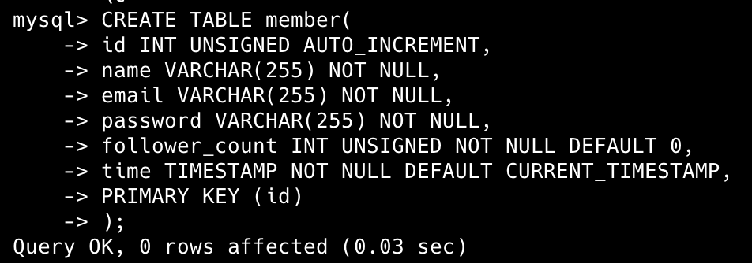

## Task 3 : SQL CRUD
### 3-1
```
mysql> INSERT INTO member (name, email, password, follower_count)
    -> VALUES
    -> ('test', 'test@test.com', 'test', 3),
    -> ('Rachel', 'Rachel@test.com', 'pw1', 4),
    -> ('Monica', 'Monica@test.com', 'pw2', 7),
    -> ('Chandler', 'Chandler@test.com', 'pw3', 2),
    -> ('Ross', 'Ross@test.com', 'pw4', 1);
```
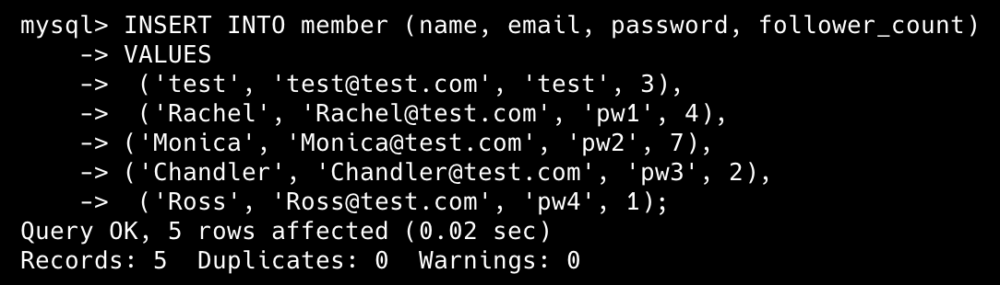

### 3-2
```
mysql> SELECT * FROM member;
```
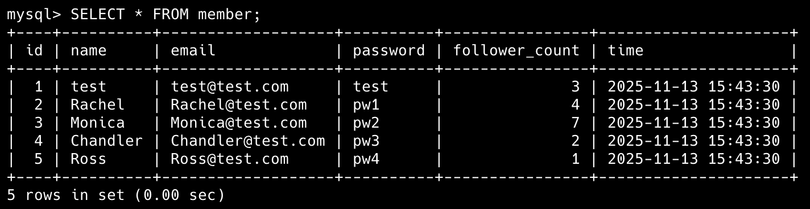

### 3-3
```
mysql> SELECT * FROM member ORDER BY time DESC;
```
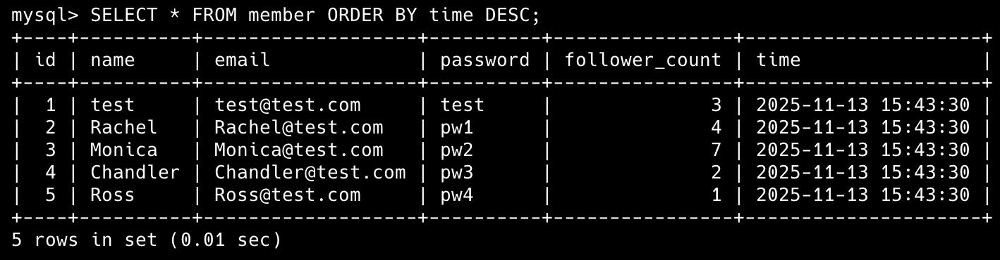

### 3-4
```
mysql> SELECT * 
    -> FROM member
    -> ORDER BY time DESC
    -> LIMIT 1, 3;
```


### 3-5
```
mysql> SELECT * 
    -> FROM member
    -> WHERE email = 'test@test.com';
```
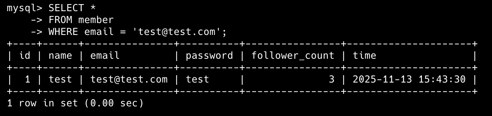

### 3-6
```
mysql> SELECT *
    -> FROM member
    -> WHERE name LIKE '%es%';
```
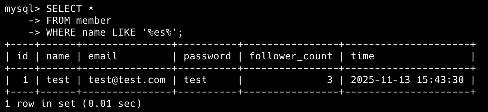

### 3-7
```
mysql> SELECT *
    -> FROM member
    -> WHERE email = 'test@test.com'
    -> AND password = 'test';
```
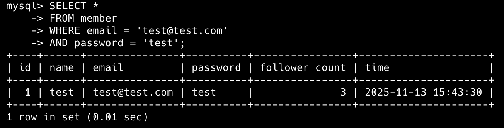

### 3-8
```
mysql> UPDATE member
    -> SET name = 'test2'
    -> WHERE email = 'test@test.com';
```
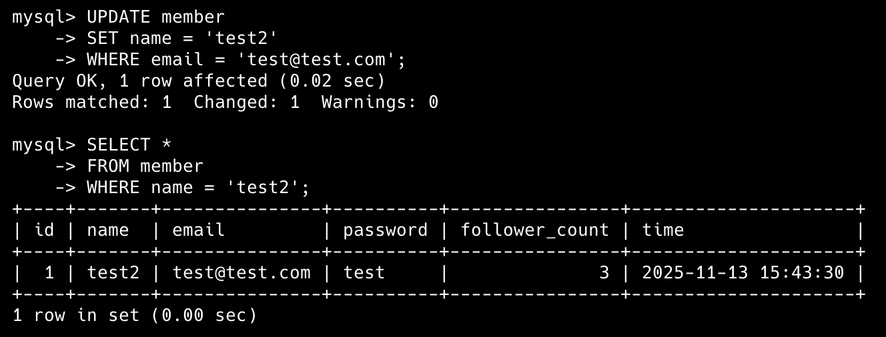

## Task 4 : SQL Aggregation Functions
### 4-1
```
mysql> SELECT COUNT(*) AS total_members
    -> FROM member;
```
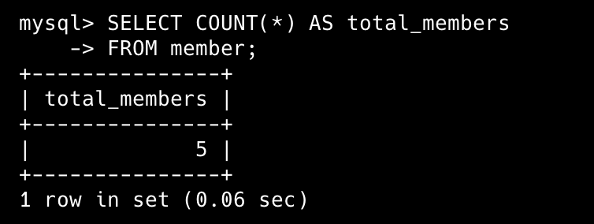

### 4-2
```
mysql> SELECT SUM(follower_count) AS sum_followers
    -> FROM member;
```
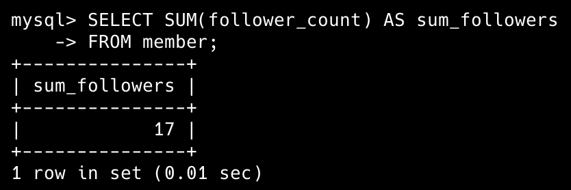

### 4-3
```
mysql> SELECT AVG(follower_count) AS avg_followers
    -> FROM member
```
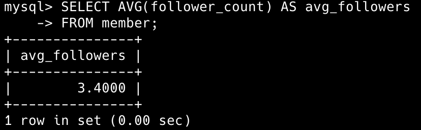

### 4-4
```
mysql> SELECT AVG(follower_count) AS avg_followers_of_top2
    -> FROM (
    -> SELECT follower_count
    -> FROM member
    -> ORDER BY follower_count DESC
    -> LIMIT 2
    -> ) AS a;
```


## Task 5 : SQL JOIN
### 5-1
```
mysql> CREATE TABLE message(
    -> id INT UNSIGNED AUTO_INCREMENT,
    -> member_id INT UNSIGNED NOT NULL,
    -> content TEXT(65535) NOT NULL,
    -> like_count INT UNSIGNED NOT NULL DEFAULT 0,
    -> time TIMESTAMP NOT NULL DEFAULT CURRENT_TIMESTAMP,
    -> PRIMARY KEY (id),
    -> FOREIGN KEY (member_id) REFERENCES member(id)
    -> );
```
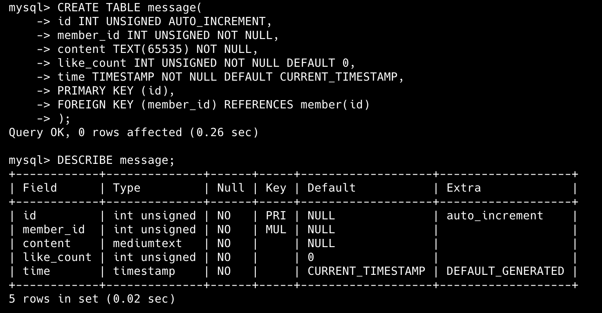

### 5-2
```
mysql> SELECT 
    -> m.id,
    -> m.content,
    -> m.like_count,
    -> m.time,
    -> mem.name  AS sender_name,
    -> mem.email AS sender_email
    -> FROM message AS m
    -> JOIN member AS mem 
    ->  ON m.member_id = mem.id;
```
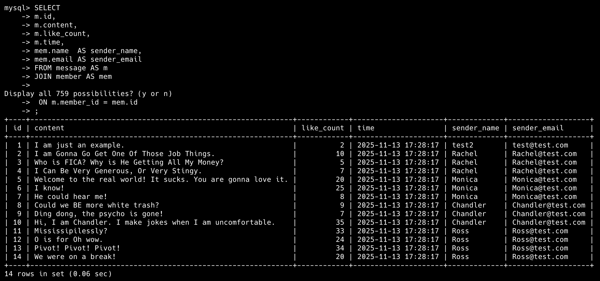

### 5-3
```
mysql> SELECT
    -> m.id,
    -> m.content,
    -> m.like_count,
    -> m.time
    -> FROM message AS m
    -> JOIN member AS mem
    -> ON m.member_id  = mem.id
    -> WHERE mem.email = 'test@test.com';
```
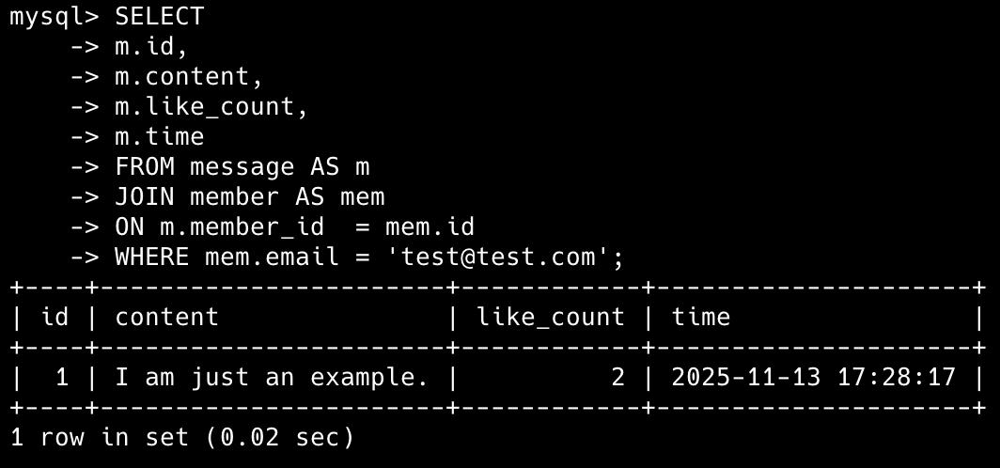

### 5-4
```
mysql> SELECT 
    -> AVG(m.like_count) AS avg_likes
    -> FROM message AS m
    -> JOIN member AS mem
    -> ON m.member_id = mem.id
    -> WHERE mem.email = 'test@test.com';
```
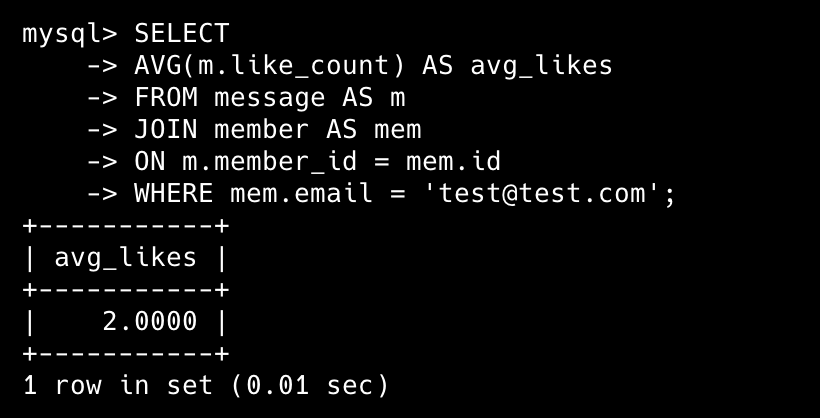

### 5-5
```
mysql> SELECT
    -> mem.email,
    -> AVG(m.like_count) AS avg_likes
    -> FROM message AS m
    -> JOIN member AS mem
    -> ON m.member_id  = mem.id
    -> GROUP BY mem.email;
```
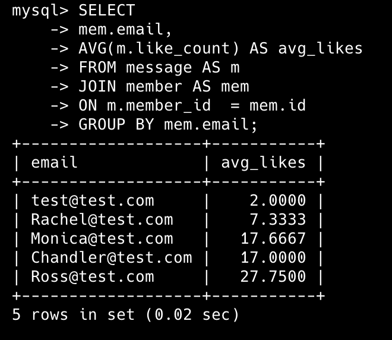
